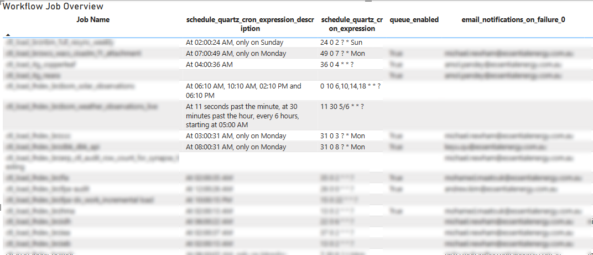
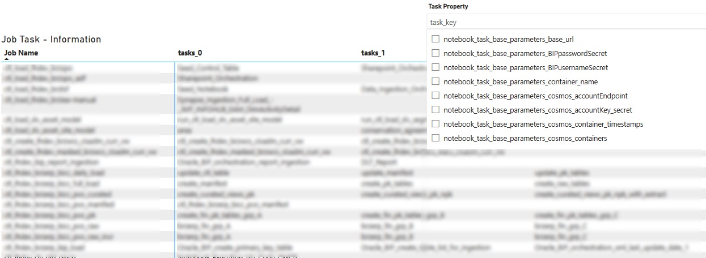
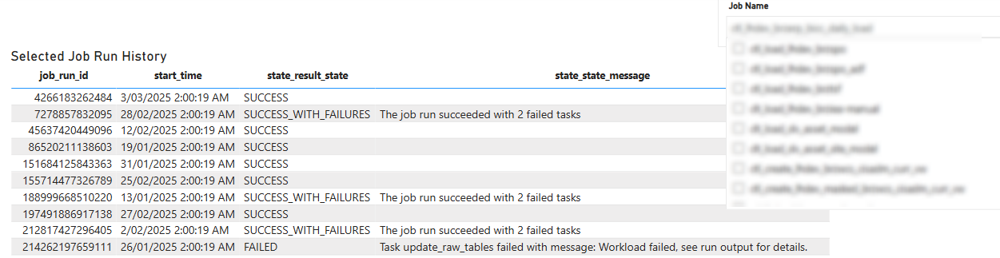
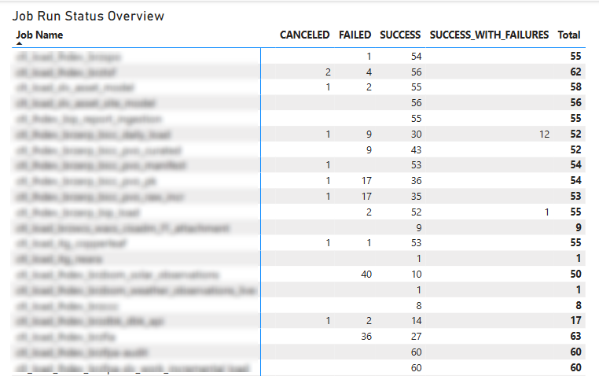
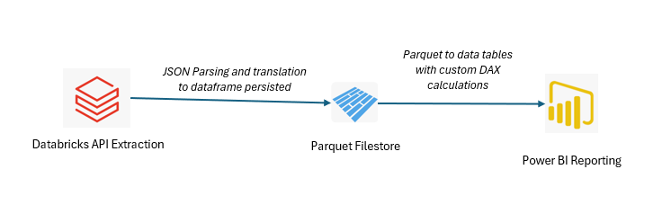
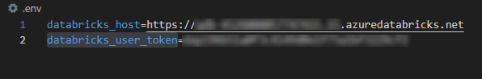
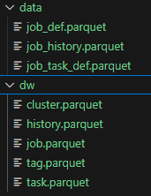

# Databricks Workflow Analyser

This project aims to deliver a user-friendly PowerBI report, generated from Databricks workflow jobs dataset (extracted via [Databricks API](https://docs.databricks.com/api/workspace/jobs)) and their historical runs. The report provides users with a comprehensive overview of jobs, their configurations, and Spark-cluster details, all in a single, easy-to-review pane.

The key highlights of this project are:

**Job Overview**

In the below, also highlight the fact that using addtional tools like [cron-descriptor](https://pypi.org/project/cron-descriptor/) we can enrich the quartz expression to human redable expression for reporting purposes.

**Job Cluster**

In the below one can switch multiple cluster related properties from the top right hand drop-down configured for the jos and get insights all in one view.

**Job Task**

In the below user can view the task configured underneath the jobs and their associated names, paths, libraries, variables and more via simialr top right hand corner dorp-down.

**Job History**

In the below the user can view the collated job previous run history and state, with neccesary error descriptions for failed jobs. 

**Run Summary**
In the below the report suggest the overall run status stats for the jobs ranging 2 mmonths (60 days) which is the defualt run archive data configured in databricks. 

# Architecture

This project is architected as follows:

The project is built in python, and the main python script execution imports and builds the parquet datastore from the [Databricks API](https://docs.databricks.com/api/workspace/jobs). Post this the Power BI can read the latest bult parquet files to render the data as highlighted above. 

# Getting Started

In drder to get started, please follow the steps: 

1. Configure the project (.env file) to use your target databricks environment 

2. Run the following python scripts in sequence to build out the parquet datastore

    * import_data.py
    * build_dw.py

    The resultant of the above will lead to following parquet files

    

3. Now from the *report* folder open the *workflow_analyzer.pbit* report template, ammend the parquet paths and refresh from the *dw* folder parquet files. And the report is now refreshed and ready to be reviewed. 

